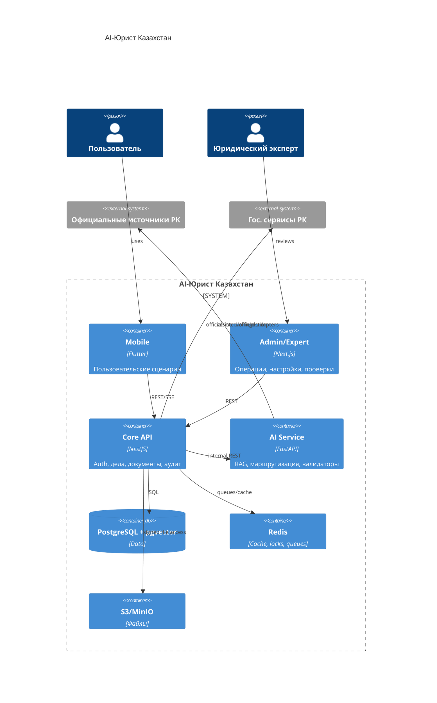

# Architecture

## Контекст

AI-Юрист Казахстан работает только для Республики Казахстан и не заменяет юриста, суд или государственный орган. Юридически значимые ответы должны ссылаться на официальные источники РК либо возвращать safe refusal.

## Контейнеры

## Trust Boundaries

- User/admin input, OCR, uploaded files, webhooks and retrieved legal text are untrusted.
- Backend enforces RBAC, ownership, idempotency and audit.
- AI receives masked PII where possible and never becomes source of law.
- Government integrations default to `assisted` unless official API access is documented.
